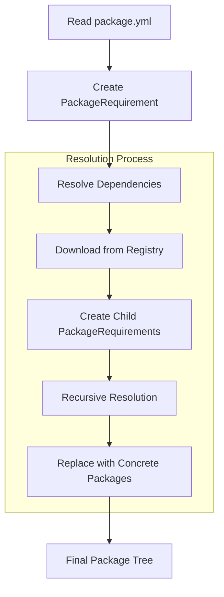
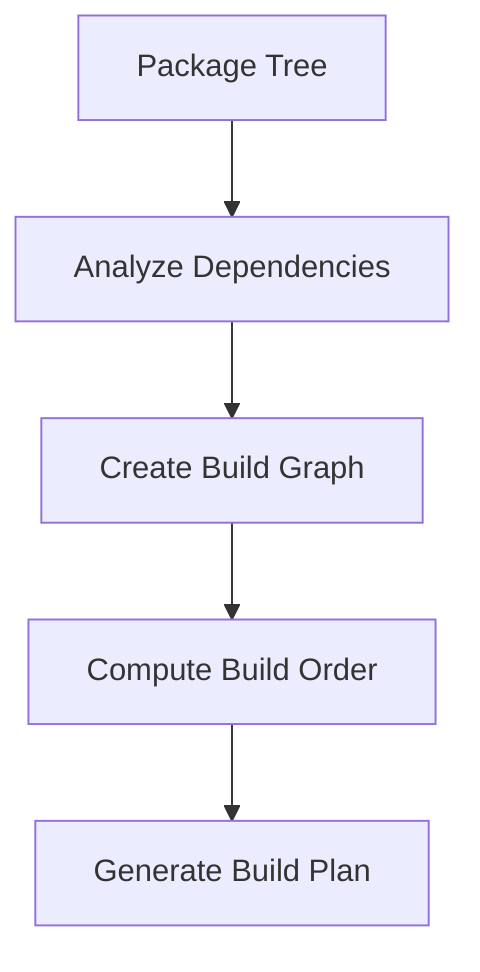
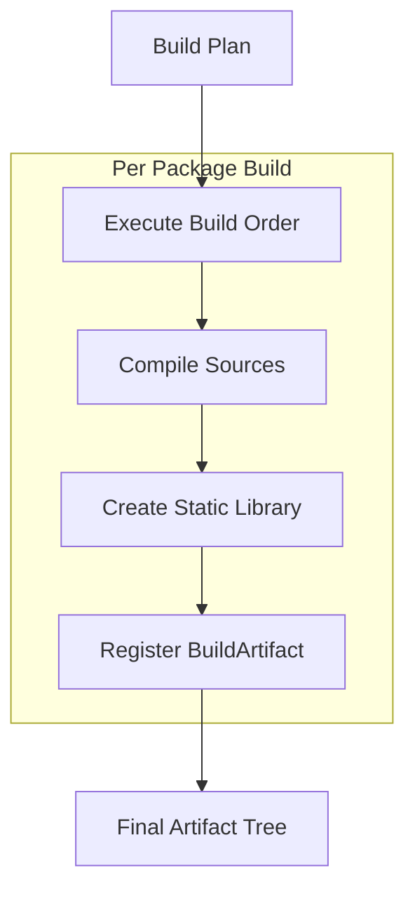
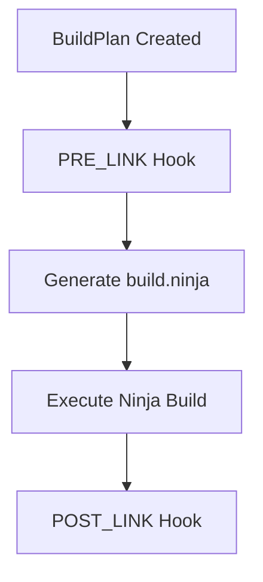

# Build System Refactor: Phase Separation

This document outlines the planned refactoring of the Clyde Package Manager build system to improve separation of concerns, testability, and maintainability. For detailed information about the hook system, see [Hook System](hook-system.md).

## Motivation

The current build system combines dependency resolution, package installation, and building into a single process. This tight coupling makes it difficult to:

- Test individual components
- Track build progress
- Collect accurate build data
- Handle errors gracefully
- Add new features

## Core Concepts

### Package States

1. **PackageRequirement**
   - Initial state from package.yml
   - Contains name, version constraints
   - Not yet downloaded or resolved

2. **Package**
   - Fully resolved and downloaded
   - Contains actual source code
   - Has concrete dependencies (other Packages)

3. **BuildPlan**
   - Intermediate state after resolution
   - Contains build order and dependencies
   - Maps packages to their build locations

4. **BuildArtifact**
   - Result of building a Package
   - Contains compiled static library
   - Has concrete dependencies (other BuildArtifacts)

### Context Objects

The build system uses different context objects for different phases:

1. **ResolutionContext**
   - Used during dependency resolution
   - Contains package requirements and registry info

2. **BuildPlanContext**
   - Used during build planning
   - Contains package tree and build order

3. **BuildExecutionContext**
   - Used during actual building
   - Contains compilation and linking info

See the [Hook System](hook-system.md) documentation for detailed information about these contexts and how they're used in hooks.

## Phase Architecture

The system is divided into three main phases, each with its own transformation process and hooks:

### 1. Install and Resolve Phase
Transforms `PackageRequirement` → `Package`



**Key Components:**
```python
class PackageRequirement:
    """Represents an unresolved package dependency"""
    name: str
    version_constraint: str
    
    def resolve(self) -> Package:
        """Resolves this requirement into a concrete package
        
        1. Downloads appropriate version from registry
        2. Creates PackageRequirements for dependencies
        3. Recursively resolves dependencies
        4. Returns fully resolved Package
        """

class ResolutionPhase:
    """Manages the resolution process"""
    
    def resolve_tree(self, root_requirement: PackageRequirement) -> Package:
        """Resolves entire dependency tree"""
```

**Hook Points:**

- PRE_RESOLUTION
- PACKAGE_DOWNLOAD_START
- PACKAGE_DOWNLOAD_COMPLETE
- DEPENDENCY_RESOLUTION_START
- DEPENDENCY_RESOLUTION_COMPLETE
- POST_RESOLUTION

### 2. Build Planning Phase
Transforms `Package` → `BuildPlan`



**Key Components:**
```python
class BuildPlan:
    """Complete plan for building package and dependencies"""
    packages: List[Package]
    build_order: List[Package]
    artifact_mapping: Dict[Package, Path]
    
    def validate(self) -> List[ValidationError]:
        """Validates the build plan"""

class BuildPlanner:
    """Creates build plans from package trees"""
    
    def create_plan(self, root_package: Package) -> BuildPlan:
        """Creates a complete build plan"""
```

**Hook Points:**

 - PRE_PLAN_CREATION 
 - DEPENDENCY_ANALYSIS_START
 - DEPENDENCY_ANALYSIS_COMPLETE
 - BUILD_ORDER_COMPUTED
 - POST_PLAN_CREATION

### 3. Build Execution Phase
Transforms `BuildPlan` → `BuildArtifact`



**Key Components:**
```python
class BuildArtifact:
    """Result of building a package"""
    package: Package
    static_library: Path
    dependencies: List[BuildArtifact]

class BuildExecutor:
    """Executes build plans"""
    
    def execute(self, plan: BuildPlan) -> BuildArtifact:
        """Executes a build plan
        
        1. Follows build order from plan
        2. Compiles each package
        3. Creates static libraries
        4. Returns root artifact
        """
```

**Hook Points:**

- PRE_BUILD_EXECUTION
- PACKAGE_BUILD_START
- COMPILATION_START
- COMPILATION_END
- STATIC_LIBRARY_CREATION
- PACKAGE_BUILD_COMPLETE
- POST_BUILD_EXECUTION

## Caching Strategy

The build system uses a per-project cache strategy, storing artifacts in the project's `.build` directory:

```
my-project/
├── package.yml
├── src/
└── .build/
    ├── artifacts/          # Built static libraries
    │   ├── my-project     # Main project artifacts
    │   └── deps/          # Dependency artifacts
    │       └── @org/
    │           └── lib/   # Dependency static libraries
    ├── cache/             # Object file cache
    │   ├── source1.o
    │   └── source2.o
    └── tmp/               # Temporary build files
```

### Cache Organization
- Each package's artifacts are isolated
- Dependencies are built within the main project's build directory
- Cache keys include:
  - Source file hash
  - Compiler version
  - Compilation flags
  - Include path hashes
  - Dependency versions

### Cache Invalidation
Cache entries are invalidated when:
- Source files change
- Compiler flags change
- Dependencies are updated
- Include files are modified

### Build Artifacts
Static libraries are stored with their metadata:
```
.build/artifacts/lib@org/lib/
├── lib.a                  # Static library
├── build_info.json        # Build metadata
└── include/              # Public headers
```

## Build System Integration

### Ninja Integration

The build system can generate and use `build.ninja` files during the Build Planning Phase. This occurs after dependency resolution but before actual compilation:



The `build.ninja` file is generated using information from:
- Resolved dependency tree
- Compilation commands
- Include paths
- Build order

Example hook usage for ninja:
```python
def pre_link_hook(context: BuildContext):
    """Generate build.ninja file before linking"""
    if context.package.is_root():
        generate_ninja_file(context)

def post_link_hook(context: BuildContext):
    """Clean up after ninja build"""
    if context.package.is_root():
        cleanup_ninja_artifacts(context)
```

### Build Data Collection

The build system collects data at various stages for inspection:

1. **Resolution Phase Data**
   - Package metadata
   - Dependency tree
   - Version resolution details
   Collected in: `PRE_BUILD`, `POST_DEPENDENCY_BUILD`

2. **Compilation Data**
   - Compiler commands
   - Include paths
   - Build metrics
   Collected in: `PRE_COMPILE`, `POST_COMPILE`

3. **Linking Data**
   - Static library creation
   - Final artifacts
   - Resource usage
   Collected in: `PRE_LINK`, `POST_LINK`

This data is stored in the build directory:
```
.build/
└── inspect/
    ├── build_data.json    # Build metrics and status
    ├── deps_graph.json    # Dependency graph
    └── metrics/           # Per-package metrics
        └── @org/
            └── lib/
                └── metrics.json
```

## Implementation Strategy

The refactor will be implemented in three main stages, corresponding to the phases:

### Stage 1: Install and Resolve
1. Implement `PackageRequirement` class
2. Create resolution system
3. Add registry integration
4. Implement recursive resolution

### Stage 2: Build Planning
1. Implement `BuildPlan` class
2. Create dependency analysis
3. Implement build ordering
4. Add plan validation

### Stage 3: Build Execution
1. Implement `BuildArtifact` class
2. Create build executor
3. Add compilation system
4. Implement static library creation

## Testing Strategy

Each phase requires specific test scenarios:

### Resolution Tests
- Version constraint resolution
- Recursive dependency resolution
- Conflict detection
- Registry integration

### Build Planning Tests
- Dependency graph creation
- Build order validation
- Circular dependency detection
- Resource allocation

### Build Execution Tests
- Compilation process
- Static library creation
- Artifact management
- Build hook execution

## Migration Path

The system will be migrated gradually:

1. Implement new resolution system alongside existing
2. Add build planning as intermediate step
3. Refactor build execution to use artifacts
4. Migrate existing hooks to new system
5. Remove old implementation

## For LLM Analysis

Key points to consider:

1. Clear state transitions between phases
2. Hook points for instrumentation
3. Error handling at phase boundaries
4. Data flow between components
5. Testing boundaries
6. Migration considerations 