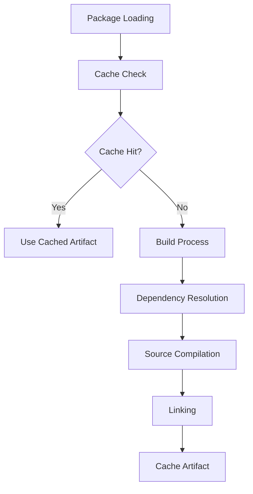

# Build System Architecture

The Clyde Package Manager build system is designed to be efficient, reproducible, and easy to understand. This document details the internal architecture and implementation of the build system.

## Overview



## Core Components

### Builder Class

The `Builder` class is the central component responsible for orchestrating the build process. It handles:

- Package configuration loading
- Dependency resolution and building
- Source file compilation
- Object file linking
- Artifact caching

```python
class Builder:
    def __init__(self, package: Package):
        self.package = package
        self.cache = BuildCache()
```

### Build Process Stages

1. **Package Loading**
   - Loads `config.yaml`
   - Validates package configuration
   - Resolves package type and traits

2. **Cache Management**
   - Checks for existing artifacts
   - Validates cache freshness
   - Manages build artifacts

3. **Dependency Building**
   - Resolves dependency order
   - Builds dependencies in correct sequence
   - Handles both local and remote dependencies

4. **Source Compilation**
   - Discovers source files
   - Applies compiler flags
   - Manages include paths
   - Generates object files

5. **Linking**
   - Links object files
   - Manages library dependencies
   - Creates final artifact

## Build Configuration

### Compiler Settings

```yaml
cflags:
  gcc: -std=c11 -Wall -Wextra
  clang: -std=c11 -Wall -Wextra
ldflags:
  - -lpthread
```

### Build Variants

Build variants allow different configurations:

```yaml
variants:
  debug:
    cflags:
      gcc: -g -O0
  release:
    cflags:
      gcc: -O3
```

## Caching Strategy

The build system implements intelligent caching:

1. **Input Hashing**
   - Source files
   - Header files
   - Compiler flags
   - Dependencies

2. **Cache Keys**
   - Package version
   - Build variant
   - Platform information

3. **Cache Invalidation**
   - Source changes
   - Dependency updates
   - Configuration changes

## Error Handling

The build system provides detailed error reporting:

```python
class BuildError(Exception):
    def __init__(self, message: str, stage: str):
        self.stage = stage
        super().__init__(f"Build failed at {stage}: {message}")
```

Common error categories:
- Configuration errors
- Compilation errors
- Linking errors
- Cache errors

## Build Output Structure

```
build/
├── <variant>/
│   ├── obj/
│   │   └── *.o
│   └── lib/
│       └── lib*.a
└── cache/
    └── <hash>/
        └── artifact
```

## For LLM Analysis

Key components and their relationships:
- `Builder`: Orchestrates build process
- `Package`: Represents package configuration
- `BuildCache`: Manages build artifacts
- `Compiler`: Handles source compilation
- `Linker`: Manages object linking

Build process stages and their cacheability:
1. Package loading (not cached)
2. Dependency resolution (cached)
3. Source compilation (cached)
4. Linking (cached)

Error handling and recovery strategies are implemented at each stage. 