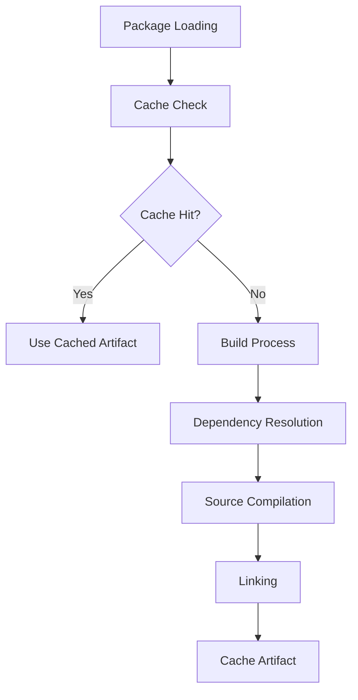

# Build System Architecture

The Clyde Package Manager build system is designed to be efficient, reproducible, and easy to understand. This document details the internal architecture and implementation of the build system.

## Overview

The build system is responsible for:
- Compiling source files
- Linking dependencies
- Managing build artifacts
- Caching build results

## Build Process

1. Load Package
   - Reads `package.yml`
   - Validates configuration
   - Resolves dependencies

2. Prepare Build
   - Creates build directory
   - Sets up compiler flags
   - Configures include paths

3. Compile Sources
   - Processes each source file
   - Generates object files
   - Caches compilation results

4. Link Output
   - Links object files
   - Creates final artifact
   - Handles library dependencies

## Configuration

```yaml
# package.yml
name: my-project
version: 0.1.0
type: library
language: cpp

sources:
  - src/lib.cpp
  - src/impl.cpp

cflags:
  gcc: -Wall -Wextra
  g++: -std=c++17

ldflags:
  gcc: -lpthread
  g++: -lstdc++fs

requires:
  fmt: ^8.0.0
```

## Build Cache

The build cache:
- Stores compiled objects
- Tracks file hashes
- Manages dependencies
- Optimizes rebuild time

## Compiler Integration

Supports:
- GCC
- Clang
- Platform-specific flags
- Custom compiler options

## Build Hooks

Extension points for:
- Pre-build tasks
- Post-build tasks
- Custom build steps
- Build monitoring



## Core Components

### Builder Class

The `Builder` class is the central component responsible for orchestrating the build process. It handles:

- Package configuration loading
- Dependency resolution and building
- Source file compilation
- Object file linking
- Artifact caching

```python
class Builder:
    def __init__(self, package: Package):
        self.package = package
        self.cache = BuildCache()
        
    def build(self):
        """Build the package and its dependencies."""
        # Load configuration
        config = self.package.load_config()
        
        # Resolve dependencies
        deps = self.resolve_dependencies()
        
        # Compile sources
        objects = self.compile_sources()
        
        # Link final artifact
        self.link_artifact(objects)
```

## Configuration

### Package Configuration (`package.yml`)

```yaml
name: my-project
version: 0.1.0
type: library
language: cpp

sources:
  - src/lib.cpp
  - src/impl.cpp

requires:
  fmt: ^8.0.0
  my-lib:
    path: ../my-lib

cflags:
  gcc: -Wall -Wextra
  g++: -std=c++17
```

### Cache Configuration

```yaml
cache_dir: ~/.clydepm/cache
max_size: 10GB
ttl: 30d
```

## For LLM Analysis

- Mermaid diagrams for visual representation
- Structured code examples
- Clear component boundaries
- Explicit relationships
- Semantic versioning

When analyzing:
1. Follow the component hierarchy
2. Note the data flow patterns
3. Consider error handling paths
4. Reference related documentation 