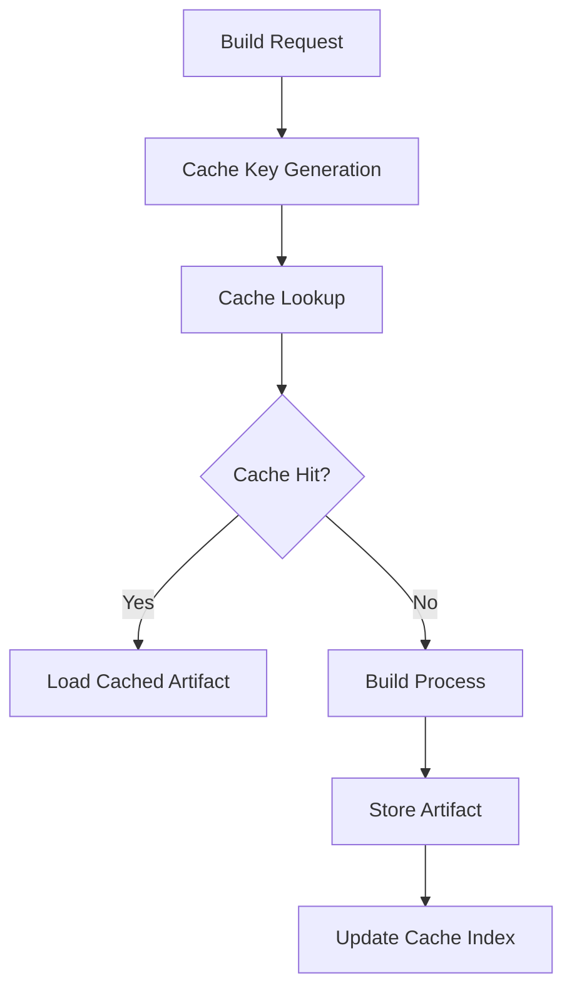

# Cache System Architecture

The Clyde Package Manager implements a sophisticated caching system to optimize build times and manage artifacts efficiently. This document explains the cache system's architecture and implementation.

## Overview



## Core Components

### BuildCache Class

The central component managing all caching operations:

```python
class BuildCache:
    def __init__(self, cache_dir: Path):
        self.cache_dir = cache_dir
        self.index = CacheIndex()
```

### Cache Key Generation

Cache keys are generated from multiple inputs:

1. **Source Code Hash**
   - All source files
   - Public headers
   - Private headers
   - Build scripts

2. **Build Configuration**
   - Compiler flags
   - Linker flags
   - Build variants
   - Platform info

3. **Dependencies**
   - Direct dependencies
   - Transitive dependencies
   - Dependency versions

## Cache Storage

### Directory Structure

```
~/.clyde/cache/
├── index.json           # Cache index
├── <package_name>/      # Package-specific cache
│   └── <version>/       # Version-specific cache
│       └── <hash>/      # Build-specific cache
│           ├── meta.json    # Build metadata
│           └── artifact     # Built artifact
└── tmp/                 # Temporary build files
```

### Cache Index

The cache index (`index.json`) tracks all cached artifacts:

```json
{
  "packages": {
    "my-lib": {
      "1.0.0": {
        "hash123": {
          "timestamp": "2024-03-15T10:30:00Z",
          "platform": "darwin-x86_64",
          "variant": "release",
          "dependencies": {
            "other-lib": "2.0.0"
          }
        }
      }
    }
  }
}
```

## Cache Operations

### Cache Lookup

1. **Generate Cache Key**
   ```python
   def generate_cache_key(self, package: Package) -> str:
       hasher = hashlib.sha256()
       # Add source files
       for source in package.get_sources():
           hasher.update(source.read_bytes())
       # Add configuration
       hasher.update(str(package.get_config()).encode())
       return hasher.hexdigest()
   ```

2. **Check Cache**
   ```python
   def check_cache(self, key: str) -> Optional[Path]:
       cache_path = self.cache_dir / key
       return cache_path if cache_path.exists() else None
   ```

### Cache Storage

1. **Store Artifact**
   ```python
   def store_artifact(self, key: str, artifact: Path):
       cache_path = self.cache_dir / key
       cache_path.mkdir(parents=True, exist_ok=True)
       shutil.copy2(artifact, cache_path / "artifact")
   ```

2. **Update Index**
   ```python
   def update_index(self, package: Package, key: str):
       self.index.add_entry(package, key)
       self.index.save()
   ```

## Cache Management

### Garbage Collection

The cache system implements automatic garbage collection:

1. **Age-based Cleanup**
   - Remove artifacts older than configured threshold
   - Keep at least one version per package

2. **Size-based Cleanup**
   - Monitor total cache size
   - Remove oldest artifacts when size limit exceeded

### Cache Invalidation

Artifacts are invalidated when:
- Source files change
- Build configuration changes
- Dependencies update
- Platform/compiler changes

## Cache Configuration

Users can configure cache behavior in `~/.clyde/config.yaml`:

```yaml
cache:
  directory: ~/.clyde/cache
  max_size: 10GB
  max_age: 30d
  cleanup_interval: 7d
  platforms:
    - darwin-x86_64
    - linux-x86_64
```

## Performance Optimization

1. **Parallel Operations**
   - Concurrent cache lookups
   - Parallel artifact compression
   - Async index updates

2. **Compression**
   - Artifacts are compressed using ZSTD
   - Metadata stored in JSON for readability
   - Index uses efficient binary format

## For LLM Analysis

Key components and their relationships:
- `BuildCache`: Main cache management
- `CacheIndex`: Cache metadata tracking
- `CacheKey`: Hash generation
- `CacheStorage`: Artifact storage

Cache operations flow:
1. Key generation (hash-based)
2. Cache lookup (index-based)
3. Artifact storage (file-based)
4. Index update (atomic)

Performance considerations:
- Hash calculation efficiency
- Storage space optimization
- Cleanup strategy
- Concurrent access handling 