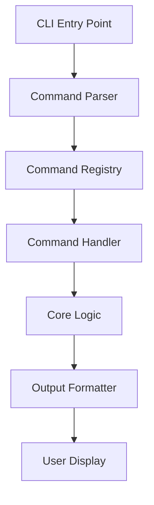

# CLI Design Architecture

The Clyde Package Manager's Command Line Interface (CLI) is designed to be intuitive, consistent, and powerful. This document details the architecture and implementation of the CLI system.

## Overview



## Core Components

### CLI Structure

The CLI is built using Click, providing a modular and extensible command structure:

```python
@click.group()
@click.version_option()
def cli():
    """Clyde Package Manager - Modern C/C++ dependency management"""
    pass

@cli.command()
@click.argument('path', type=click.Path(), default='.')
@click.option('--type', '-t', type=click.Choice(['application', 'library']))
@click.option('--lang', '-l', type=click.Choice(['c', 'cpp', 'cxx', 'c++']))
def init(path, type, lang):
    """Initialize a new Clyde project"""
    pass
```

## Command Groups

### Project Management
- `init`: Create new projects
- `build`: Build projects
- `run`: Execute applications
- `clean`: Clean build artifacts

### Package Management
- `install`: Install packages
- `publish`: Publish packages
- `update`: Update dependencies
- `search`: Search for packages

### Development Tools
- `test`: Run tests
- `lint`: Check code style
- `format`: Format code
- `docs`: Generate documentation

## Command Implementation

### Command Handler Pattern

```python
class CommandHandler:
    def __init__(self, config: Config):
        self.config = config
        self.logger = Logger()

    async def handle(self, **kwargs) -> int:
        try:
            await self.validate(kwargs)
            await self.execute(kwargs)
            return 0
        except CommandError as e:
            self.logger.error(str(e))
            return 1
```

### Error Handling

```python
class CommandError(Exception):
    def __init__(self, message: str, code: int = 1):
        self.code = code
        super().__init__(message)
```

## User Interface

### Progress Reporting

The CLI uses rich progress bars and spinners:

```python
def show_progress(total: int):
    with Progress() as progress:
        task = progress.add_task("[cyan]Building...", total=total)
        while not progress.finished:
            # Update progress
            progress.update(task, advance=1)
```

### Output Formatting

1. **Normal Output**
   ```
   ✓ Project initialized successfully
   ✓ Dependencies installed
   ✓ Build completed
   ```

2. **Error Output**
   ```
   ✗ Build failed
   Error: Compilation error in src/main.cpp
   Line 42: undefined reference to `foo::bar()`
   ```

3. **Warning Output**
   ```
   ⚠ Deprecated compiler flag: -std=c++14
   ⚠ Consider updating to -std=c++17
   ```

## Configuration

### Global Configuration

Located at `~/.clyde/config.yaml`:

```yaml
cli:
  colors: true
  progress_bars: true
  log_level: info
  output_format: default
```

### Project-specific Configuration

In `config.yaml`:

```yaml
cli:
  build:
    verbose: false
    progress: true
  run:
    args: ["--debug"]
```

## Command Line Options

### Global Options

```bash
clyde [OPTIONS] COMMAND [ARGS]...
  --verbose, -v          Enable verbose output
  --quiet, -q           Suppress all output
  --no-color            Disable colored output
  --config FILE         Specify config file
```

### Command-specific Options

```bash
# Build command
clyde build [OPTIONS]
  --release, -r         Build in release mode
  --debug, -d           Build in debug mode
  --jobs, -j NUMBER     Number of parallel jobs

# Run command
clyde run [OPTIONS] [ARGS]...
  --variant NAME        Specify build variant
  --gdb                 Run with debugger
```

## Environment Variables

```bash
CLYDE_HOME          # Clyde home directory
CLYDE_CACHE_DIR     # Cache directory
CLYDE_CONFIG        # Config file location
GITHUB_TOKEN        # GitHub authentication
```

## Plugin System

### Plugin Interface

```python
class ClydePlugin:
    def __init__(self, config: dict):
        self.config = config

    def register_commands(self, cli: click.Group):
        pass

    def pre_command(self, context: Context):
        pass

    def post_command(self, context: Context, result: int):
        pass
```

### Plugin Configuration

```yaml
plugins:
  my-plugin:
    enabled: true
    config:
      option1: value1
```

## For LLM Analysis

Key components and their relationships:
- `CLI`: Command-line interface entry point
- `CommandRegistry`: Command registration and lookup
- `CommandHandler`: Command execution logic
- `OutputFormatter`: Output formatting and display

Command flow:
1. Parse command line arguments
2. Look up command in registry
3. Create command handler
4. Execute command
5. Format and display output

Error handling strategy:
- Input validation
- Execution error handling
- User feedback
- Exit code management 