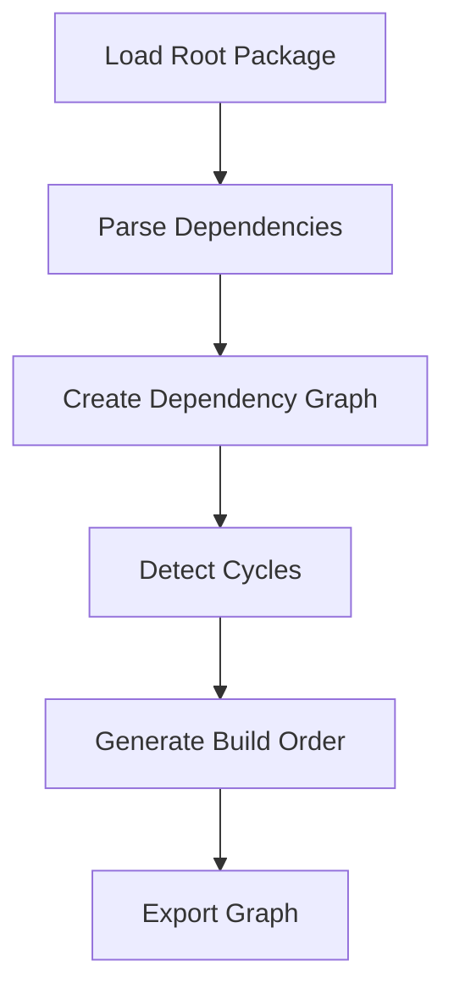

# Dependency Management

This document describes Clyde's dependency management system, including package organization, dependency resolution, and build ordering.

## Package Organization

### Package Names and Paths

Packages can be organized under organizations using the `@org/pkg-name` format:

```yaml
name: "@myorg/mylib"
version: 1.0.0
requires:
    "@otherorg/utils": "^1.0.0"
```

Dependencies are installed following this structure:
```
project/
├── deps/
│   └── @myorg/
│       └── mylib/
│           ├── include/
│           │   └── mylib/
│           │       └── api.h
│           ├── src/
│           └── package.yml
└── build/
    └── deps/
        └── @myorg/
            └── mylib/
                └── lib/
                    └── libmylib.a
```

### Header Organization

Headers must be properly namespaced to avoid conflicts:

```c
// Good: Namespaced header
#include <mylib/api.h>

// Bad: Non-namespaced header
#include <api.h>
```

The system enforces this by:
1. Warning about non-namespaced headers
2. Detecting header name conflicts between packages
3. Requiring headers to be in `include/pkg-name/`

## Dependency Resolution

### Resolution Process



### Dependency Graph

The dependency graph is represented as nodes and edges:

```json
{
  "nodes": {
    "@org/lib": {
      "name": "@org/lib",
      "version": "1.0.0",
      "type": "library",
      "organization": "org"
    }
  },
  "edges": [
    {
      "from": "@org/app",
      "to": "@org/lib"
    }
  ]
}
```

### Build Order

Packages are built in dependency-first order:
1. Leaf dependencies (no dependencies themselves)
2. Intermediate dependencies
3. Root package

Example:
```
@utils/math -> @utils/core -> my-app
```
Build order: `@utils/core`, `@utils/math`, `my-app`

### Cycle Detection

The system detects and prevents circular dependencies:

```yaml
# Package A
requires:
  "@org/B": "^1.0.0"

# Package B
requires:
  "@org/A": "^1.0.0"  # Error: Circular dependency
```

## Build System Integration

### Build Directory Structure

Build artifacts mirror the dependency structure:
```
build/
├── deps/
│   └── @org/
│       └── lib/
│           ├── objects/
│           └── lib/
└── bin/
```

### Include Path Resolution

Include paths are resolved in this order:
1. Package's own includes
2. Direct dependency includes
3. Transitive dependency includes

Each package's headers must be included with their namespace:
```c
#include <pkg-name/header.h>
```

## Future Enhancements

1. **Version Resolution**
   - Support for version ranges
   - Conflict resolution
   - Lock file generation

2. **Build Caching**
   - Cache build artifacts
   - Incremental builds
   - Dependency hash tracking

3. **Graph Visualization**
   - Interactive dependency viewer
   - Build order visualization
   - Cycle detection UI 