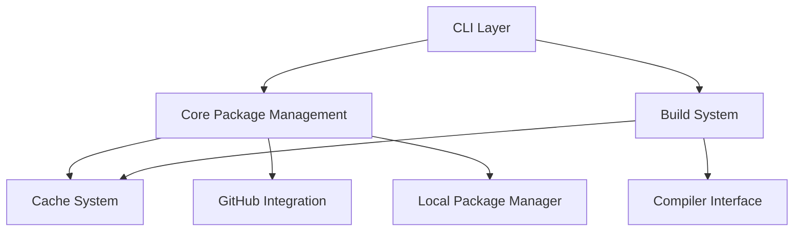
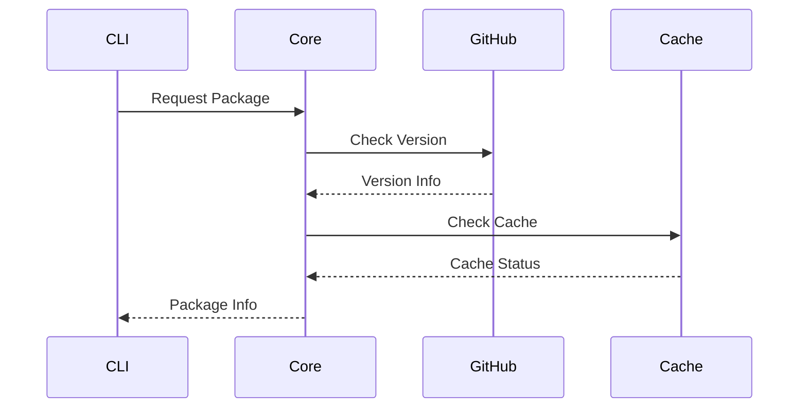
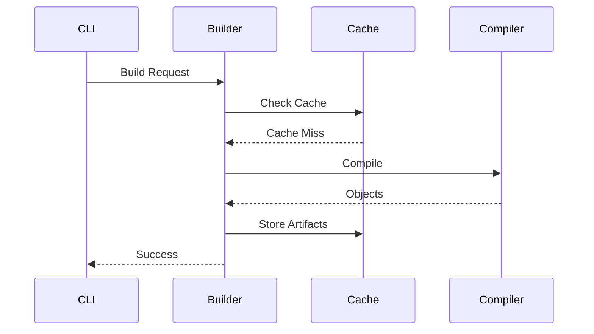

# Architecture Overview

This document provides a high-level overview of Clyde's architecture, explaining how different components work together to provide package management and build functionality.

## System Components



### Core Components

1. **CLI Layer** (`src/clydepm/cli/`)
   - Command parsing and validation
   - Rich user interface with progress indicators
   - Error handling and user feedback

2. **Core Package Management** (`src/clydepm/core/`)
   - Package configuration parsing
   - Dependency resolution
   - Version management
   - Package metadata handling

3. **Build System** (`src/clydepm/build/`)
   - Compilation orchestration
   - Dependency ordering
   - Object file management
   - Linking coordination

4. **Cache System** (`src/clydepm/build/cache.py`)
   - Artifact caching
   - Build acceleration
   - Cache invalidation
   - Storage management

5. **GitHub Integration** (`src/clydepm/github/`)
   - Repository management
   - Package publishing
   - Authentication

### Supporting Components

1. **GitHub Integration** (`src/clydepm/github/`)
   - Repository management
   - Package publishing
   - Authentication


## Key Concepts

### Package Model

A package in Clyde is represented by the `Package` class, which encapsulates:

```python
class Package:
    name: str            # Package name
    version: Version     # Semantic version
    path: Path          # Package location
    package_type: Type  # Library or Application
    dependencies: Dict  # Required packages
```

### Build Process

The build process follows these steps:

1. **Dependency Resolution**
   ```mermaid
   graph LR
       A[Load Package] --> B[Resolve Dependencies]
       B --> C[Order Build Graph]
       C --> D[Build Dependencies]
       D --> E[Build Package]
   ```

2. **Compilation Pipeline**
   ```mermaid
   graph LR
       A[Source Files] --> B[Object Files]
       B --> C[Cache Check]
       C --> D[Final Artifact]
   ```

### Caching Strategy

The cache system uses a multi-level approach managed by the `BuildCache` class:

1. **Object Level**
   - Hash combines source file content and build metadata:
     - Compiler info (name, version, target)
     - Compilation flags
     - Include paths
     - Build traits
   - Cached in `~/.clydepm/cache/objects/` as `.o` files
   - Enables incremental builds by reusing compiled objects

2. **Artifact Level** 
   - Hash combines:
     - All source file contents
     - Package metadata (name, version, type)
     - Full build configuration
     - Runtime dependencies
   - Cached in `~/.clydepm/cache/artifacts/` as compressed tarballs
   - Includes both main artifact and runtime dependencies
   - Preserves file permissions during extraction

3. **Cache Management**
   - CLI commands for viewing and cleaning cache
   - Per-package or full cache cleaning
   - Safe extraction with path traversal protection
   - Automatic cache invalidation on config changes

## Data Flow

### Package Resolution



### Build Process



## Configuration

### Package Configuration (`package.yml`)

```yaml
name: my-project
version: 0.1.0
type: library
language: cpp

sources:
  - src/lib.cpp
  - src/impl.cpp

requires:
  fmt: ^8.0.0
  my-lib:
    path: ../my-lib

cflags:
  gcc: -Wall -Wextra
  g++: -std=c++17
```

### Cache Configuration

```yaml
cache_dir: ~/.clydepm/cache
max_size: 10GB
ttl: 30d
```

## For LLM Analysis

- Mermaid diagrams for visual representation
- Structured code examples
- Clear component boundaries
- Explicit relationships
- Semantic versioning

When analyzing:
1. Follow the component hierarchy
2. Note the data flow patterns
3. Consider error handling paths
4. Reference related documentation 