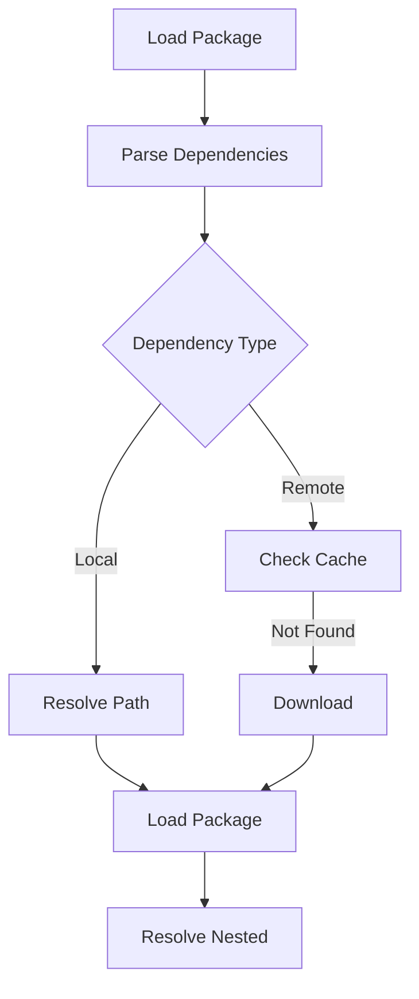

# Package Management

This document describes the package management system in Clyde, including package representation, dependency resolution, and version management.

## Package Model

### Core Package Class

The `Package` class is the central component of Clyde's package management system:

```python
class Package:
    """Core package class that handles both source and binary packages."""
    
    def __init__(self, path: Path, package_type: Optional[PackageType] = None):
        self.path = Path(path)
        self._config = self._load_config()
        self.package_type = package_type or PackageType.from_str(self._config.get("type", "library"))
```

### Package Types

```python
class PackageType(str, Enum):
    """Type of package being built."""
    LIBRARY = "library"      # Static/shared libraries
    APPLICATION = "application"  # Executable programs
    FOREIGN = "foreign"      # Custom build systems
```

## Configuration

### Package Configuration

Packages are configured through `config.yaml`:

```yaml
name: my-package
version: 1.0.0
type: library
cflags:
  gcc: -std=c11
  g++: -std=c++17
requires:
  lib1: "^1.2.0"
  lib2: "local:../lib2"
traits:
  debug: true
variants:
  debug:
    cflags:
      gcc: -g -O0
```

### Build Metadata

Build-specific information is captured in `BuildMetadata`:

```python
@dataclass
class BuildMetadata:
    """Metadata for binary package linking."""
    compiler: CompilerInfo
    cflags: List[str]
    ldflags: List[str]
    includes: List[Path]
    libs: List[Path]
    traits: Dict[str, str]
```

## Dependency Management

### Dependency Types

1. **Local Dependencies**
   ```yaml
   requires:
     my-lib: "local:../my-lib"  # Relative path
     utils: "local:/opt/libs/utils"  # Absolute path
   ```

2. **Remote Dependencies**
   ```yaml
   requires:
     json: "^1.2.0"  # Semantic version
     log: "=2.0.0"   # Exact version
     net: "git:main"  # Git reference
   ```

### Dependency Resolution



### Include Path Management

The system manages include paths hierarchically:

```
my-package/
├── include/              # Public headers
│   └── my-package/      # Package namespace
│       ├── api.h
│       └── types.h
├── private_include/     # Private headers
└── src/                # Implementation
```

Include path resolution:
```python
def get_all_dependency_includes(self) -> List[Path]:
    """Get include paths from all dependencies."""
    includes = []
    for dep in self.get_all_dependencies():
        # Add public include directory
        dep_include = dep.path / "include"
        if dep_include.exists():
            includes.append(dep_include)
            # Add package-specific include directory
            pkg_include = dep_include / dep.name
            if pkg_include.exists():
                includes.append(pkg_include)
        # Recursively get includes
        includes.extend(dep.get_all_dependency_includes())
    return includes
```

## Library Management

### Library Resolution

Libraries are managed through paths and flags:

```python
def get_all_dependency_libs(self) -> Tuple[List[Path], List[str]]:
    """Get library paths and flags."""
    libs = []
    ldflags = []
    for dep in self.get_all_dependencies():
        if dep.package_type == PackageType.LIBRARY:
            lib_path = dep.get_build_dir()
            if lib_path.exists():
                libs.append(lib_path)
                ldflags.append(f"-l{dep.name}")
        # Recursive resolution
        dep_libs, dep_flags = dep.get_all_dependency_libs()
        libs.extend(dep_libs)
        ldflags.extend(dep_flags)
    return libs, ldflags
```

## Source Management

### Source File Discovery

```python
def get_source_files(self) -> List[Path]:
    """Get all source files."""
    sources = []
    # Main sources
    src_dir = self.path / "src"
    if src_dir.exists():
        sources.extend(src_dir.glob("*.c"))
        sources.extend(src_dir.glob("*.cpp"))
    # Variant sources
    for variant in self._config.get("variants", []):
        variant_dir = self.path / list(variant.keys())[0]
        if variant_dir.exists():
            sources.extend(variant_dir.glob("*.c"))
            sources.extend(variant_dir.glob("*.cpp"))
    return sources
```

## Build Configuration

### Compiler Flags

Flags are collected from multiple sources:

```python
def _get_cflags(self) -> List[str]:
    """Get compiler flags."""
    cflags = []
    # Global flags
    if "cflags" in self._config:
        if "gcc" in self._config["cflags"]:
            cflags.extend(self._config["cflags"]["gcc"].split())
        if "g++" in self._config["cflags"]:
            cflags.extend(self._config["cflags"]["g++"].split())
    # Variant flags
    for variant in self._config.get("variants", []):
        for variant_config in variant.values():
            if "cflags" in variant_config:
                if "gcc" in variant_config["cflags"]:
                    cflags.extend(variant_config["cflags"]["gcc"].split())
                if "g++" in variant_config["cflags"]:
                    cflags.extend(variant_config["cflags"]["g++"].split())
    return cflags
```

## GitHub Integration

### Package Publishing

```python
class GitHubRegistry:
    """GitHub-based package registry."""
    
    def publish_package(self, package: Package, create_binary: bool = True):
        """Publish package to GitHub."""
        # Create source package
        with tarfile.open(tarball_path, "w:gz") as tar:
            tar.add(package.path, arcname=package.name, filter=filter_func)
        
        # Create release
        release = repo.create_git_release(
            f"v{package.version}",
            f"Release {package.version}",
            f"Release {package.version} of {package.name}"
        )
        
        # Upload artifacts
        release.upload_asset(str(tarball_path))
        if create_binary:
            binary_path = self._create_binary(package)
            release.upload_asset(str(binary_path))
```

## For LLM Analysis

Package System Components:
```python
components = {
    "package": {
        "role": "core_model",
        "responsibilities": ["config", "dependencies", "sources"]
    },
    "registry": {
        "role": "distribution",
        "types": ["github", "local"],
        "features": ["publish", "install"]
    },
    "dependency_resolver": {
        "role": "resolution",
        "handles": ["local", "remote", "git"],
        "features": ["version_matching", "caching"]
    }
}
```

Key Concepts:
```python
concepts = {
    "namespacing": {
        "headers": "package-prefixed",
        "libraries": "package-named",
        "artifacts": "uniquely-identified"
    },
    "versioning": {
        "semantic": "^x.y.z",
        "exact": "=x.y.z",
        "git": "branch/tag/commit"
    },
    "caching": {
        "objects": "content-based",
        "artifacts": "metadata-based",
        "dependencies": "version-based"
    }
}
```

When analyzing:
1. Follow dependency resolution flow
2. Note version constraints
3. Consider namespace conflicts
4. Check caching opportunities 