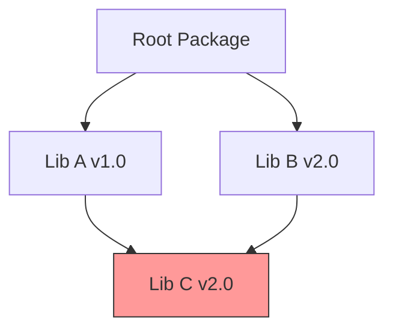

# Enhanced Dependency Resolution

The dependency resolution system handles complex dependency graphs, version conflicts, and ensures reproducible builds.

## Overview

The system provides:
- Circular dependency detection
- Diamond dependency resolution
- Version conflict resolution
- Build-time dependency optimization

## Architecture

### Dependency Graph



### Core Components

```python
class DependencyGraph:
    """Represents the package dependency graph."""
    
    def __init__(self):
        self.nodes = {}  # Package nodes
        self.edges = {}  # Dependencies
        
    def add_dependency(self, from_pkg: Package, to_pkg: Package):
        """Add dependency relationship."""
        self.edges.setdefault(from_pkg, set()).add(to_pkg)
        
    def detect_cycles(self) -> List[List[Package]]:
        """Find circular dependencies."""
        return self._find_cycles(self.edges)
        
    def resolve_conflicts(self) -> Dict[str, Package]:
        """Resolve version conflicts."""
        return self._resolve_version_conflicts()
```

## Version Resolution

### Algorithm

1. Build dependency graph
2. Detect cycles
3. Identify version conflicts
4. Apply resolution strategy
5. Generate build order

```python
class VersionResolver:
    """Resolves version conflicts."""
    
    def resolve(self, graph: DependencyGraph) -> Dict[str, str]:
        """Resolve version conflicts in graph."""
        conflicts = self._find_conflicts(graph)
        strategy = self._select_strategy(conflicts)
        return strategy.apply(conflicts)
        
    def _select_strategy(self, conflicts: List[Conflict]) -> ResolutionStrategy:
        """Select appropriate resolution strategy."""
        if self._is_simple_conflict(conflicts):
            return SimpleResolutionStrategy()
        return AdvancedResolutionStrategy()
```

## Conflict Resolution

### Strategies

1. **Highest Version**
   - Select highest compatible version
   - Update dependents if needed
   - Verify build compatibility

2. **Minimal Version**
   - Use lowest compatible version
   - Reduce upgrade cascades
   - Maintain stability

3. **Custom Resolution**
   - User-defined rules
   - Override file support
   - Project-specific policies

```python
class ResolutionStrategy:
    """Base class for resolution strategies."""
    
    def apply(self, conflicts: List[Conflict]) -> Dict[str, str]:
        """Apply resolution strategy."""
        resolved = {}
        for conflict in conflicts:
            version = self._resolve_conflict(conflict)
            resolved[conflict.package] = version
        return resolved
```

## Build Order

### Topological Sort

```python
class BuildOrderGenerator:
    """Generates optimal build order."""
    
    def generate(self, graph: DependencyGraph) -> List[Package]:
        """Generate build order from graph."""
        visited = set()
        order = []
        
        def visit(pkg: Package):
            if pkg in visited:
                return
            visited.add(pkg)
            for dep in graph.edges[pkg]:
                visit(dep)
            order.append(pkg)
            
        for pkg in graph.nodes:
            visit(pkg)
            
        return order
```

## Error Handling

### Common Issues

1. **Circular Dependencies**
   ```python
   def handle_circular_dependency(cycle: List[Package]):
       """Handle circular dependency error."""
       logger.error(f"Circular dependency detected: {' -> '.join(p.name for p in cycle)}")
       raise CircularDependencyError(cycle)
   ```

2. **Version Conflicts**
   ```python
   def handle_version_conflict(conflict: VersionConflict):
       """Handle version conflict error."""
       logger.error(f"Version conflict for {conflict.package}: {conflict.required_versions}")
       raise VersionConflictError(conflict)
   ```

## Future Enhancements

### Phase 1
- [ ] Parallel dependency resolution
- [ ] Caching resolved graphs
- [ ] Better error messages
- [ ] Resolution suggestions

### Phase 2
- [ ] Optional dependencies
- [ ] Development dependencies
- [ ] Platform-specific resolution
- [ ] Custom resolvers

### Phase 3
- [ ] Remote resolution
- [ ] Dependency impact analysis
- [ ] Security checking
- [ ] Performance optimization

## Integration Points

- Package Lock System
- Build System
- Registry
- Cache System
- Build Inspector 