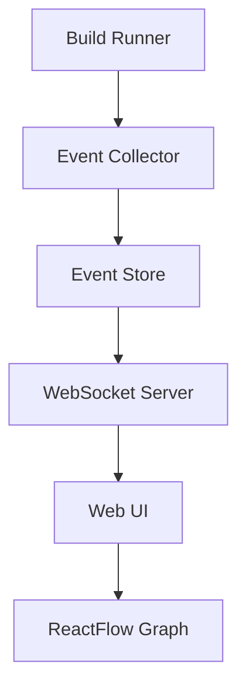

# Clyde Inspect

`clyde inspect` is an interactive dependency and build visualization tool that provides insights into your project's structure, build process, and dependencies.

## Overview

The tool provides a web-based interface for visualizing:
- Package dependency graph
- Build information and timing
- Cache performance
- Compilation details
- Source file relationships

## Architecture

### Components



### 1. Build System Integration

```python
class InstrumentedBuildRunner:
    """Wraps the existing build system with instrumentation."""
    
    def __init__(self):
        self.event_collector = EventCollector()
        self.build_id = None
        
    async def run_build(self, package: Package):
        """Run build with instrumentation."""
        self.build_id = uuid.uuid4()
        
        # Start build event
        await self.event_collector.record({
            'type': 'build_start',
            'build_id': self.build_id,
            'package': package.name,
            'timestamp': datetime.now()
        })
        
        try:
            result = await self._run_actual_build(package)
            return result
        finally:
            # End build event
            await self.event_collector.record({
                'type': 'build_end',
                'build_id': self.build_id,
                'timestamp': datetime.now()
            })
            
    async def _run_actual_build(self, package: Package):
        """Actual build process with hooks."""
        # Hook into compile commands
        # Hook into cache operations
        # Hook into dependency resolution
        pass
```

### 2. Event Collection & Storage

```python
class EventCollector:
    """Collects and stores build and dependency events."""
    
    def __init__(self):
        self.db = RxDB()  # In-memory initially, persistent later
        
    async def record(self, event: dict):
        """Record an event."""
        await self.db.events.insert({
            'id': uuid.uuid4(),
            **event
        })
        
    async def get_build_events(self, build_id: str):
        """Get all events for a build."""
        return await self.db.events.find({
            'build_id': build_id
        }).exec()
```

### 3. Web Application

#### Backend (FastAPI)

```python
class InspectServer:
    """Serves the web UI and handles WebSocket connections."""
    
    def __init__(self):
        self.app = FastAPI()
        self.clients = set()
        
    async def start(self):
        """Start the server."""
        self.app.mount("/", StaticFiles(directory="web/dist"))
        
    @app.websocket("/ws")
    async def websocket_endpoint(self, websocket: WebSocket):
        await websocket.accept()
        self.clients.add(websocket)
        try:
            while True:
                data = await websocket.receive_json()
                # Handle client requests
        finally:
            self.clients.remove(websocket)
```

#### Frontend (Next.js)

```typescript
// types.ts
interface PackageNode {
  id: string;
  type: 'package';
  data: {
    name: string;
    version: string;
    buildTime?: number;
    cacheHits?: number;
    cacheMisses?: number;
  };
}

// components/DependencyGraph.tsx
const DependencyGraph: React.FC = () => {
  const [nodes, setNodes] = useState<Node[]>([]);
  const [edges, setEdges] = useState<Edge[]>([]);
  
  useEffect(() => {
    // Connect to WebSocket
    const ws = new WebSocket('ws://localhost:3000/ws');
    ws.onmessage = (event) => {
      const data = JSON.parse(event.data);
      updateGraph(data);
    };
    
    return () => ws.close();
  }, []);
  
  return (
    <ReactFlow
      nodes={nodes}
      edges={edges}
      nodeTypes={customNodes}
      onNodeClick={handleNodeClick}
    />
  );
};
```

### Custom Node Types

```typescript
// components/PackageNode.tsx
const PackageNode: React.FC<PackageNodeProps> = ({ data }) => {
  const [expanded, setExpanded] = useState(false);
  
  return (
    <div className="package-node">
      <div className="summary" onClick={() => setExpanded(!expanded)}>
        <h3>{data.name}</h3>
        <div className="metrics">
          <span>Build: {formatTime(data.buildTime)}</span>
          <span>Cache: {data.cacheHits}/{data.cacheHits + data.cacheMisses}</span>
        </div>
      </div>
      
      {expanded && (
        <div className="details">
          <CompilationList commands={data.commands} />
          <SourceTree files={data.sources} />
        </div>
      )}
    </div>
  );
};
```

## Future Enhancements

### Phase 1 (Current)
- Basic dependency visualization
- Build timing information
- Cache hit/miss statistics
- Simple hierarchical layout
- Source file viewing

### Phase 2
- Historical build data
- Multiple layout options
- Advanced filtering
- Build problems panel
- Performance improvements

### Phase 3
- Real-time build updates
- IDE integration
- Custom graph layouts
- Build optimization suggestions
- Advanced analytics

## Usage

```bash
# Start the visualization server
clyde inspect

# Start with specific port
clyde inspect --port 3000

# Open in browser (default)
clyde inspect --open

# Export static report
clyde inspect --export report.html
```

## Implementation Notes

### Data Flow
1. Build system emits events
2. Events are collected and stored
3. WebSocket server broadcasts updates
4. UI updates in real-time
5. Graph maintains state using RxDB

### Performance Considerations
- Lazy loading of detailed information
- Efficient graph updates
- Careful WebSocket message sizing
- Browser memory management

### Security
- Local-only server
- No sensitive data in events
- Sanitized command output
- Safe file path handling 