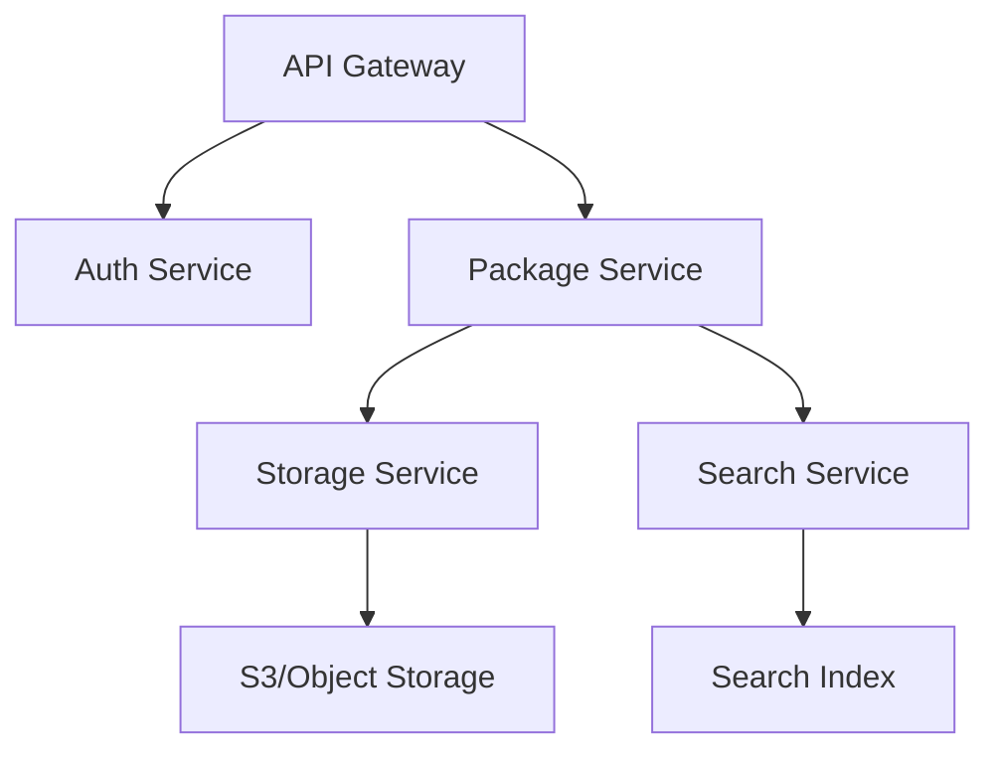

# Registry Integration

The registry system provides package distribution and discovery through both GitHub and custom registry servers.

## Overview

The registry system supports:
- GitHub repository integration
- Custom registry servers
- Package namespacing
- Access control
- Package metadata

## GitHub Integration

### Package Format
```yaml
# .clyde/package.yaml in GitHub repo
name: my-package
version: "1.2.3"
description: "Package description"
homepage: "https://github.com/owner/repo"
license: "MIT"
authors: ["Author Name <email@example.com>"]
```

### GitHub Actions Integration
```yaml
name: Clyde Package
on:
  release:
    types: [created]

jobs:
  publish:
    runs-on: ubuntu-latest
    steps:
      - uses: actions/checkout@v2
      - uses: clydepm/action-publish@v1
        with:
          token: ${{ secrets.GITHUB_TOKEN }}
```

## Custom Registry

### Architecture



### API Endpoints

```python
@router.get("/packages/{name}")
async def get_package(name: str):
    """Get package metadata."""
    return await package_service.get_package(name)

@router.post("/packages")
async def publish_package(package: PackageUpload):
    """Publish a new package version."""
    return await package_service.publish(package)

@router.get("/search")
async def search_packages(q: str):
    """Search for packages."""
    return await search_service.search(q)
```

### Package Storage

```python
class StorageService:
    """Manages package storage."""
    
    async def store_package(self, package: Package, data: bytes):
        """Store package data."""
        key = f"{package.name}/{package.version}"
        await self.storage.put_object(key, data)
        
    async def get_package(self, name: str, version: str):
        """Retrieve package data."""
        key = f"{name}/{version}"
        return await self.storage.get_object(key)
```

### Search Service

```python
class SearchService:
    """Package search functionality."""
    
    async def index_package(self, package: Package):
        """Index package metadata."""
        doc = {
            "name": package.name,
            "version": package.version,
            "description": package.description,
            "keywords": package.keywords,
            "updated_at": datetime.now()
        }
        await self.index.add_document(doc)
```

## Web Interface

### Features
- Package browsing and search
- Documentation viewer
- Package statistics
- User management
- Access control

### Implementation
```typescript
// pages/packages/[name].tsx
const PackagePage: NextPage = () => {
  const { name } = useRouter().query;
  const { data: package } = usePackage(name);
  
  return (
    <Layout>
      <PackageHeader package={package} />
      <PackageVersions versions={package.versions} />
      <PackageReadme content={package.readme} />
      <PackageDependencies deps={package.dependencies} />
    </Layout>
  );
};
```

## Authentication

### Methods
- GitHub OAuth
- API tokens
- Organization accounts

### Implementation
```python
class AuthService:
    """Authentication service."""
    
    async def authenticate_github(self, code: str):
        """Authenticate with GitHub OAuth."""
        token = await self.github.get_token(code)
        user = await self.github.get_user(token)
        return await self.create_session(user)
        
    async def create_api_token(self, user: User):
        """Create API token for user."""
        token = self.generate_token()
        await self.store_token(user, token)
        return token
```

## Future Enhancements

### Phase 1
- [ ] Package signing
- [ ] Download statistics
- [ ] Dependency analysis
- [ ] Vulnerability scanning

### Phase 2
- [ ] Mirror support
- [ ] Organization features
- [ ] Webhooks
- [ ] API documentation

### Phase 3
- [ ] Package federation
- [ ] Build artifacts
- [ ] Analytics dashboard
- [ ] Plugin system 