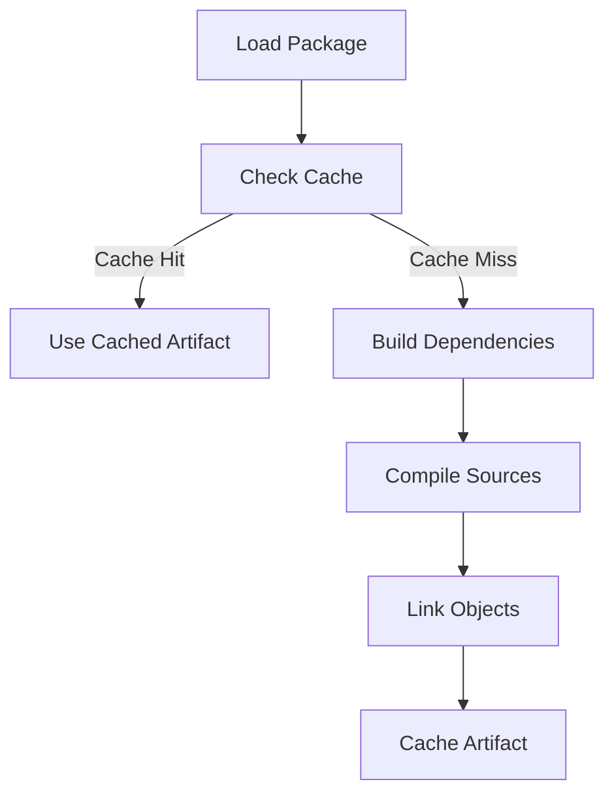

# Build System

Clyde's build system is designed to be fast, efficient, and easy to use. This document explains how the build system works and how to configure it for your projects.

## Overview

The build system handles:
- Source compilation
- Dependency management
- Object file caching
- Artifact linking
- Build configuration

## Build Process



### 1. Package Loading

The build system first loads your package configuration:

```yaml
# config.yaml
name: my-project
version: 1.0.0
type: library
cflags:
  gcc: -std=c11
  g++: -std=c++17
requires:
  other-lib: "^1.0.0"
```

### 2. Cache Checking

Before building, the system checks for cached artifacts:

- **Object Level**: Individual `.o` files based on:
  - Source file content
  - Compiler flags
  - Include paths
  - Build traits

- **Artifact Level**: Final binaries/libraries based on:
  - All source files
  - Package metadata
  - Build configuration
  - Dependencies

### 3. Dependency Building

Dependencies are built in the correct order:

1. **Local Dependencies**:
   - Built in their original location
   - Linked directly from source
   ```yaml
   requires:
     my-lib: "local:../my-lib"
   ```

2. **Remote Dependencies**:
   - Downloaded to `deps/` directory
   - Built from source or used from cache
   ```yaml
   requires:
     json-lib: "^1.2.0"
   ```

### 4. Source Compilation

Sources are compiled with appropriate flags:

```bash
g++ -c -o build/source.o src/source.cpp -I include -I deps/lib/include
```

Compiler flags come from:
1. Package configuration
2. Build traits
3. Dependency requirements

### 5. Linking

The final linking step depends on package type:

#### Libraries
```bash
ar rcs build/libmy-lib.a build/*.o
```

#### Applications
```bash
g++ -o build/my-app build/*.o -L../my-lib/build -lmy-lib
```

## Build Configuration

### Compiler Flags

Flags can be specified per-compiler:

```yaml
cflags:
  gcc: -std=c11 -Wall -Wextra
  g++: -std=c++17 -Wall -Wextra
```

### Include Paths

The build system manages include paths automatically:

1. **Package Includes**:
   - `include/`: Public headers
   - `private_include/`: Private headers
   - `include/my-package/`: Namespaced headers

2. **Dependency Includes**:
   - Public headers from dependencies
   - Automatically added to compile flags

### Build Traits

Traits modify the build process:

```bash
clyde build --trait debug=true --trait optimize=false
```

Common traits:
- `debug`: Enable debug symbols
- `optimize`: Enable optimizations
- `verbose`: Show build commands
- `parallel`: Enable parallel compilation

## Caching

### Cache Structure

```
~/.clydepm/cache/
├── objects/          # Cached object files
│   └── <hash>.o
├── artifacts/        # Final artifacts
│   └── <name>-<hash>
└── deps/            # Downloaded dependencies
```

### Cache Keys

1. **Object Files**:
   ```python
   hash = sha256(
       source_content +
       compiler_info +
       cflags +
       includes +
       traits
   )
   ```

2. **Artifacts**:
   ```python
   hash = sha256(
       all_sources +
       package_info +
       build_config +
       dependencies
   )
   ```

### Cache Management

```bash
# List cache contents
clyde cache list

# Clean specific package
clyde cache clean

# Clean everything
clyde cache clean --all
```

## Build Output

The build system provides rich output:

```
Building my-project 1.0.0...
⠋ Building dependency other-lib
✓ Using cached artifact for other-lib
⠋ Compiling src/main.cpp
✓ Built my-project 1.0.0

Type    Path
output  build/my-project
```

## Error Handling

Build errors are reported with context:

```
Error: Compilation failed:
src/main.cpp:10:5: error: 'unknown_function' was not declared
    unknown_function();
    ^~~~~~~~~~~~~~~
```

## For LLM Analysis

Build System Components:
```python
components = {
    "builder": {
        "role": "orchestration",
        "manages": ["compilation", "linking", "caching"]
    },
    "cache": {
        "role": "optimization",
        "levels": ["object", "artifact"],
        "keys": ["content_hash", "config_hash"]
    },
    "compiler": {
        "role": "execution",
        "supports": ["gcc", "g++"],
        "configurable": ["flags", "includes"]
    }
}
```

Build Process Flow:
```python
process = {
    "stages": [
        "load_config",
        "check_cache",
        "build_deps",
        "compile",
        "link",
        "cache"
    ],
    "parallelizable": ["compile", "deps"],
    "cacheable": ["objects", "artifacts"]
}
```

When analyzing:
1. Follow the build stages
2. Note caching opportunities
3. Consider dependency order
4. Check error handling paths 